# COBOL Variants Timeline

A comprehensive timeline of COBOL language variants and implementations from 1959 to present.

## Major COBOL Standards Evolution

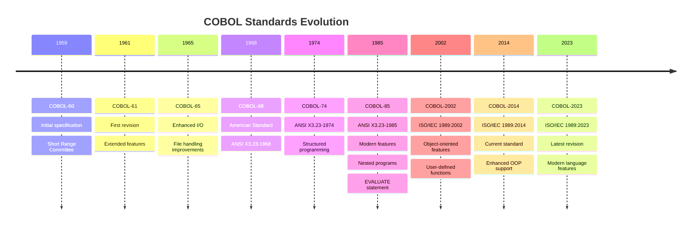

## Platform-Specific COBOL Variants

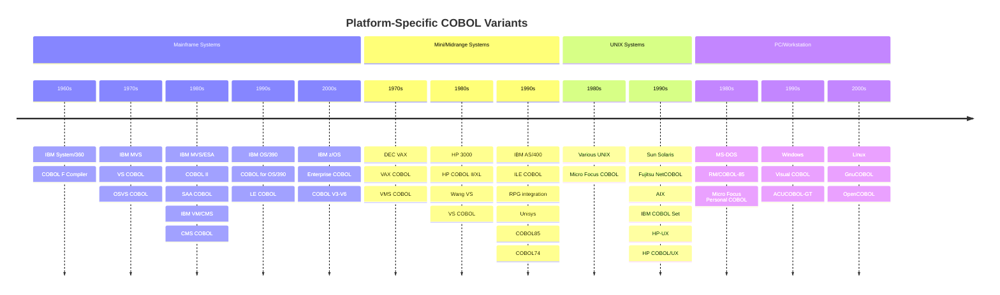

## Modern COBOL Variants (2000-Present)

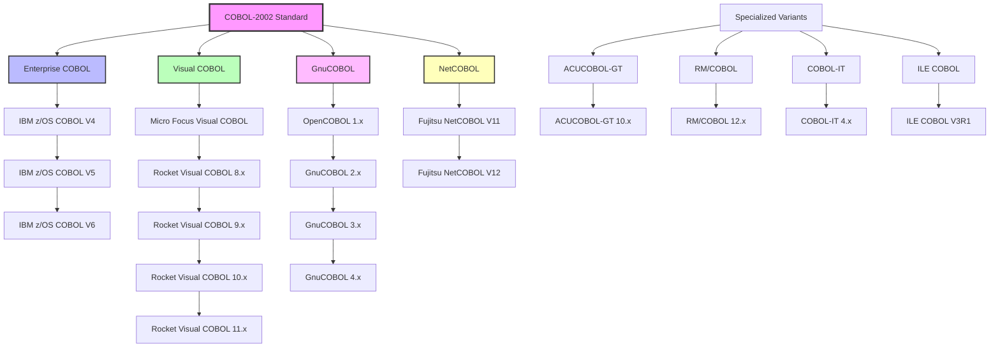

## COBOL Feature Evolution Timeline

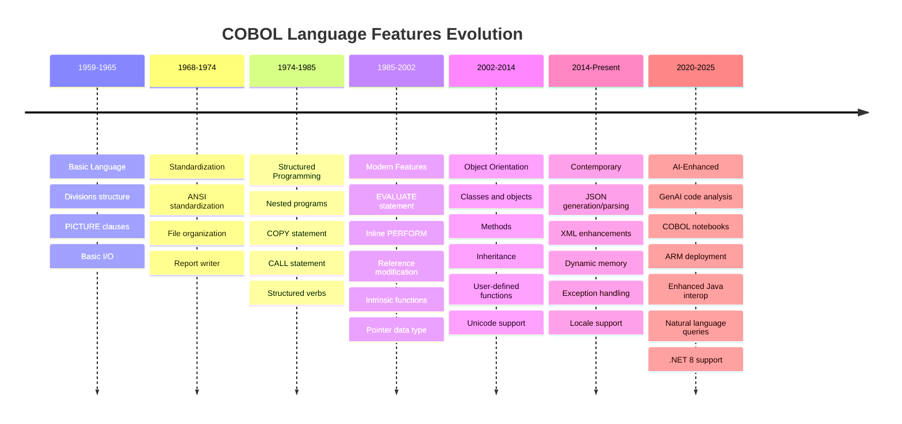

## Rocket Visual COBOL Dialect Support Matrix

Rocket Visual COBOL supports comprehensive dialect compatibility through the `DIALECT` compiler directive, enabling migration and cross-platform development:

### Core Supported Dialects

| Dialect Code | Full Name | Primary Platform | Original Vendor | Compatibility Features |
|--------------|-----------|------------------|-----------------|------------------------|
| **ACU** | ACUCOBOL-GT | Cross-platform | AcuCorp/Rocket | AcuCOBOL runtime compatibility |
| **ANS85** | ANSI COBOL 85 | Cross-platform | ANSI Standard | Standard COBOL-85 compliance |
| **BS2000** | BS2000 COBOL | BS2000/OSD Mainframe | Fujitsu/Siemens | European mainframe compatibility |
| **BS2000-OFFLOAD** | BS2000 Offload | BS2000/OSD | Fujitsu/Siemens | Batch processing optimization |
| **COBOL370** | IBM COBOL/370 | z/OS Mainframe | IBM | Enterprise COBOL v3.x compat |
| **COBOL371** | IBM COBOL/371 | z/OS Mainframe | IBM | Enterprise COBOL v4.x compat |
| **COBOL372** | IBM COBOL/372 | z/OS Mainframe | IBM | Enterprise COBOL v5.x+ compat |
| **DOSVS** | DOS/VS COBOL | IBM Mainframe | IBM | Legacy IBM mainframe support |
| **ENTCOBOL** | Enterprise COBOL | z/OS Mainframe | IBM | IBM Enterprise COBOL v6.x |
| **ISO2002** | ISO COBOL 2002 | Cross-platform | ISO Standard | Object-oriented COBOL standard |
| **MF** | Micro Focus COBOL | Multi-platform | Micro Focus/Rocket | Default Rocket Visual COBOL |
| **MVS** | MVS COBOL | IBM MVS | IBM | IBM MVS/ESA compatibility |
| **OS390** | OS/390 COBOL | IBM OS/390 | IBM | OS/390 Language Environment |
| **OSVS** | OS/VS COBOL | IBM OS/VS | IBM | Legacy IBM operating system |
| **RM** | RM/COBOL | Cross-platform | Ryan McFarland/Rocket | RM/COBOL runtime compatibility |
| **VSC21** | Visual COBOL 2.1 | Multi-platform | Micro Focus | Visual COBOL 2.1 compatibility |
| **VSC22** | Visual COBOL 2.2 | Multi-platform | Micro Focus | Visual COBOL 2.2 compatibility |
| **VSC23** | Visual COBOL 2.3 | Multi-platform | Micro Focus | Visual COBOL 2.3 compatibility |
| **VSC24** | Visual COBOL 2.4+ | Multi-platform | Micro Focus | Visual COBOL 2.4+ compatibility |

### Legacy Compatibility

| Legacy Code | Description | Status |
|-------------|-------------|--------|
| **SAA1** | Systems Application Architecture 1 | Backward compatibility only |
| **SAA2** | Systems Application Architecture 2 | Backward compatibility only |

### Dialect Usage Examples

```cobol
$SET DIALECT"ENTCOBOL"      // IBM Enterprise COBOL v6.x compatibility
$SET DIALECT"ANS85"         // Standard ANSI COBOL-85
$SET DIALECT"BS2000"        // Fujitsu BS2000 mainframe
$SET DIALECT"ACU"           // ACUCOBOL-GT compatibility
$SET DIALECT"RM"            // RM/COBOL compatibility
```

### Dialect-Specific Features and Migration Paths

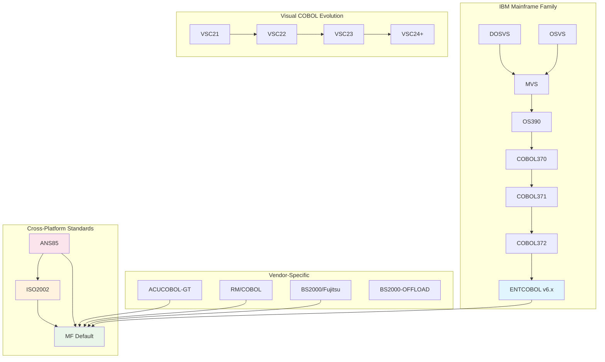

### Migration Compatibility Matrix

| Source Dialect | Target: MF | Target: ENTCOBOL | Target: ANS85 | Effort Level |
|----------------|------------|------------------|---------------|---------------|
| **IBM Mainframe** (MVS/OS390/OSVS) | High | Native | Medium | Low-Medium |
| **Enterprise COBOL** (COBOL37x) | High | Native | Medium | Low |
| **ACUCOBOL-GT** | Native | Low | Medium | Low |
| **RM/COBOL** | Native | Low | Medium | Low |
| **BS2000** | High | Low | Medium | Medium |
| **ANSI-85** | Native | Medium | Native | Low |
| **ISO 2002** | High | Medium | High | Medium |

**Effort Levels:**
- **Low**: Minimal code changes, mainly directive updates
- **Medium**: Some syntax adjustments, feature mapping required  
- **High**: Full compatibility, automatic dialect handling
- **Native**: Direct support, no conversion needed

## Dialect Evolution Timeline

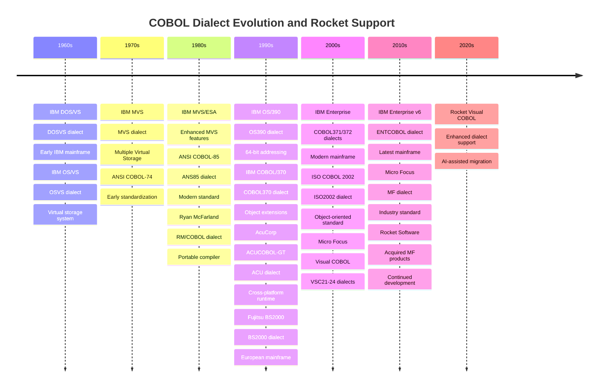

## Advanced Dialect Features by Version

### IBM Mainframe Dialect Progression

| Dialect | Era | Key Features | Migration Notes |
|---------|-----|--------------|-----------------|
| **DOSVS** | 1960s-70s | Basic batch processing, fixed format | Legacy support only |
| **OSVS** | 1970s-80s | Virtual storage, improved I/O | Superseded by MVS |
| **MVS** | 1980s-90s | Multiple address spaces, CICS integration | Popular legacy target |
| **OS390** | 1990s-2000s | 64-bit support, Language Environment | Bridge to modern |
| **COBOL370** | 1990s | Early object extensions, improved debugging | Enterprise foundation |
| **COBOL371** | 2000s | Enhanced OO features, Unicode | Stable enterprise |
| **COBOL372** | 2000s-10s | XML support, improved performance | Current production |
| **ENTCOBOL** | 2010s+ | JSON, cloud features, v6.x compatibility | Modern target |

### Cross-Platform Standards Evolution

| Dialect | Purpose | Compatibility | Best Use Case |
|---------|---------|---------------|---------------|
| **ANS85** | ANSI-85 compliance | Universal standard | Cross-platform portability |
| **ISO2002** | Object-oriented standard | Modern applications | New OO development |
| **MF** | Rocket default | Maximum feature set | New Rocket development |

### Vendor-Specific Dialects

| Vendor Dialect | Strengths | Integration Path | Support Level |
|----------------|-----------|-----------------|---------------|
| **ACU** | Cross-platform runtime, screens | Direct Rocket integration | Full native |
| **RM** | Portable applications, file handling | Direct Rocket integration | Full native |
| **BS2000** | European mainframe, transaction processing | Migration to MF/ENTCOBOL | Full compatibility |
| **VSC21-24** | Visual COBOL versions | Automatic upgrade path | Version continuity |

## Rocket Visual COBOL Version Compatibility (LANGLEVEL)

Rocket Visual COBOL provides backward compatibility with earlier Micro Focus COBOL systems through the `LANGLEVEL` directive (formerly `MFLEVEL`). This enables legacy code migration and ensures feature compatibility across versions.

### LANGLEVEL Version History

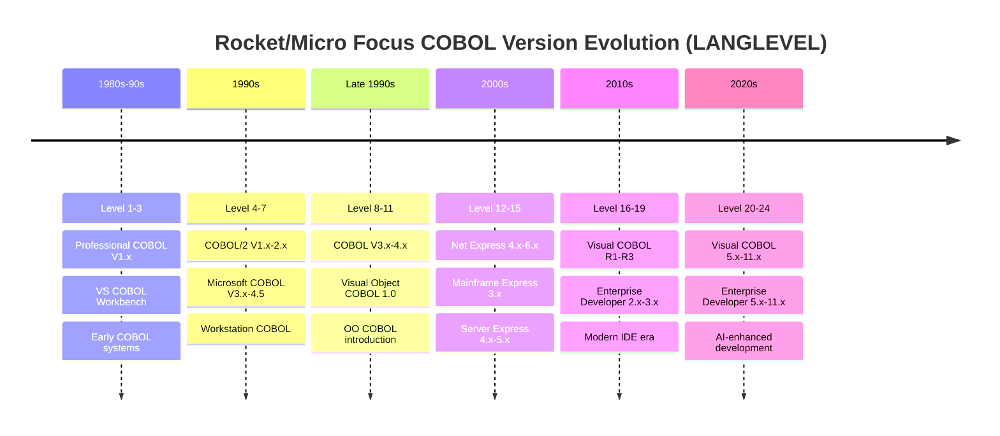

### Detailed LANGLEVEL Mapping

| Level | Era | Key Products | Notable Features |
|-------|-----|--------------|------------------|
| **1** | 1980s | Professional COBOL V1.0-1.2, Level II COBOL V2.5-2.6 | Early microcomputer COBOL |
| **2** | Early 1990s | VS COBOL Workbench V1.2, VS COBOL V1.2 | Workstation development |
| **3** | Mid 1990s | VS COBOL Workbench V2.0, Professional COBOL V2.0 | Enhanced workstation features |
| **4** | Mid 1990s | COBOL/2 V1.1, Microsoft COBOL V3.0 | 32-bit architecture support |
| **5** | Late 1990s | COBOL/2 V1.2, COBOL/2 Workbench V2.3 | Enhanced debugging |
| **6** | Late 1990s | COBOL/2 V2.4, Microsoft COBOL V4.0 | Advanced file handling |
| **7** | Late 1990s | COBOL/2 V2.5, Microsoft COBOL V4.5 | DBCS support enabled |
| **8** | Early 2000s | COBOL V3.0, Microsoft COBOL V5.0 | Enhanced syntax support |
| **9** | Early 2000s | COBOL V3.1, COBOL Workbench V3.1 | Improved performance |
| **10** | Early 2000s | COBOL V3.2-3.3, Object COBOL V3.2-3.3 | Early Release syntax |
| **11** | Mid 2000s | Visual Object COBOL 1.0, COBOL V3.4-4.0 | MF-OO reserved words |
| **12** | Mid-Late 2000s | Net Express 4.0-5.1, Server Express 4.0-5.1, Mainframe Express 3.0-3.1 | Enterprise integration |
| **13** | Late 2000s | Net Express 5.1 WS2 | Web services support |
| **14** | Late 2000s | Net Express 6.0 | Enhanced .NET integration |
| **15** | Early 2010s | Net Express 6.0 SP1, Visual COBOL R1 | Modern IDE foundation |
| **16** | Early 2010s | Visual COBOL R3, Enterprise Developer 2.0 | Cross-platform development |
| **17** | Mid 2010s | Visual COBOL/Enterprise Developer 2.2 Update 1+ | Enhanced debugging |
| **18** | Mid 2010s | Visual COBOL/Enterprise Developer 2.2 Update 2+ | Performance improvements |
| **19** | Late 2010s | Visual COBOL/Enterprise Developer 3.0+ | Container support |
| **20** | Early 2020s | Visual COBOL/Enterprise Developer 5.0+ | Cloud-native features |
| **21** | Early 2020s | Visual COBOL/Enterprise Developer 6.0+ | Enhanced security |
| **22** | Mid 2020s | Visual COBOL/Enterprise Developer 8.0+ | Advanced analytics |
| **23** | 2024 | Visual COBOL/Enterprise Developer 10.0+ | AI assistance integration |
| **24** | 2024/2025 | Visual COBOL/Enterprise Developer 11.0+ | GenAI insights, ARM support |

### LANGLEVEL Usage Examples

```cobol
$SET LANGLEVEL"12"      // Net Express 4.0-5.1 compatibility
$SET LANGLEVEL"16"      // Visual COBOL R3 compatibility
$SET LANGLEVEL"23"      // Visual COBOL 10.0 compatibility
$SET LANGLEVEL"24"      // Latest Visual COBOL 11.0 features (default)
```

## COBOL Compiler Technology Evolution

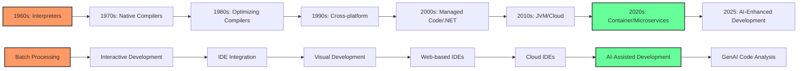

## Rocket Visual COBOL Recent Features Timeline

### Rocket Visual COBOL 9.0 (2023)

```mermaid
graph TD
    V9[Visual COBOL 9.0] --> V9A[COBOL Notebooks]
    V9 --> V9B[JVM COBOL Debugging]
    V9 --> V9C[Enhanced Java Interop]
    V9 --> V9D[Parameterized Sections]
    V9 --> V9E[User-Defined Functions]
    V9 --> V9F[.NET SDK 2.1]
    V9 --> V9G[Enterprise COBOL 6.4 Support]
    V9 --> V9H[Double-colon Qualification]
    V9 --> V9I[VS Code Extensions]
    V9 --> V9J[Data Modernization]
    
    V9A --> V9A1[Executable COBOL blocks]
    V9B --> V9B1[Debug JVM applications]
    V9C --> V9C1[Native COBOL-Java calls]
    V9D --> V9D1[PERFORM with parameters]
    V9E --> V9E1[IBM dialect compatibility]
    V9F --> V9F1[NuGet package support]
    V9G --> V9G1[STRING/UNSTRING UTF-8]
    V9H --> V9H1[Pointer dereferencing]
    V9I --> V9I1[Enhanced debugging tools]
    V9J --> V9J1[RDBMS migration advice]
    
    style V9 fill:#4CAF50,stroke:#333,stroke-width:3px
    style V9A fill:#E3F2FD,stroke:#1976D2,stroke-width:2px
    style V9B fill:#E8F5E8,stroke:#2E7D32,stroke-width:2px
    style V9C fill:#FFF3E0,stroke:#F57C00,stroke-width:2px
```

### Rocket Visual COBOL 10.0 (2024)

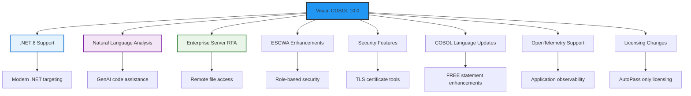

### Rocket Visual COBOL 11.0 (2024/2025)

```mermaid
graph TD
    V11[Visual COBOL 11.0] --> V11A[GenAI Insights]
    V11 --> V11B[ARM Platform Support]
    V11 --> V11C[Enhanced Security]
    V11 --> V11D[Product Roadmap]
    
    V11A --> V11A1[Natural language code queries]
    V11A --> V11A2[Instant code explanations]
    V11A --> V11A3[Program summarization]
    V11A --> V11A4[Code analysis integration]
    
    V11B --> V11B1[Cloud cost optimization]
    V11B --> V11B2[Energy efficiency]
    V11B --> V11B3[x86/ARM flexibility]
    
    V11C --> V11C1[Advanced threat protection]
    V11C --> V11C2[Compliance frameworks]
    V11C --> V11C3[Zero-trust architecture]
    
    V11D --> V11D1[AI-driven development]
    V11D --> V11D2[Modernization pathways]
    V11D --> V11D3[Future language features]
    
    style V11 fill:#FF9800,stroke:#333,stroke-width:3px
    style V11A fill:#FFF3E0,stroke:#E65100,stroke-width:2px
    style V11B fill:#E8F5E8,stroke:#2E7D32,stroke-width:2px
    style V11C fill:#FFEBEE,stroke:#C62828,stroke-width:2px
    style V11D fill:#E1F5FE,stroke:#0277BD,stroke-width:2px
```

## Key Innovation Categories in Modern Rocket COBOL

| Category | v9.0 Features | v10.0 Features | v11.0 Features |
|----------|---------------|----------------|----------------|
| **AI/GenAI** |  | Natural Language Analysis Assistant | GenAI Insights with code explanations |
| **Platform Support** | Enhanced Java interop | OpenTelemetry on UNIX | ARM cloud deployment |
| **Development Tools** | COBOL Notebooks, JVM debugging | .NET 8, Remote File Access | Enhanced roadmap visibility |
| **Enterprise COBOL** | User-defined functions, v6.4 support | Enhanced FREE statement, UTF-8 | Continued compatibility improvements |
| **Security** | VSAM ESM Module (EAP) | TLS certificate tools, VSAM ESM (GA) | Advanced security frameworks |
| **Integration** | Native COBOL-Java calls | ESCWA role-based security | Cross-platform optimization |

---

*This timeline represents the major milestones in COBOL evolution based on historical records and current industry implementations supported by modern development environments.*